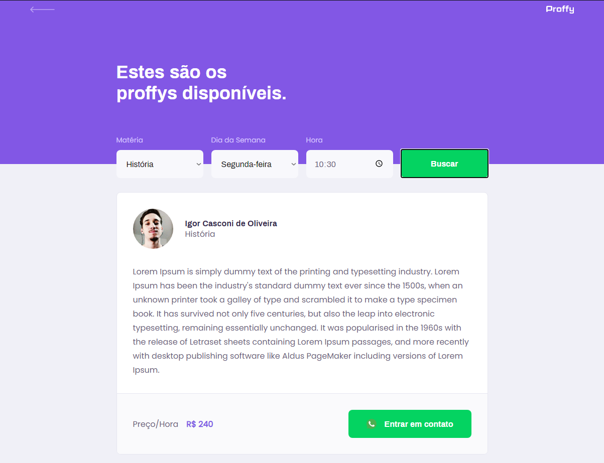
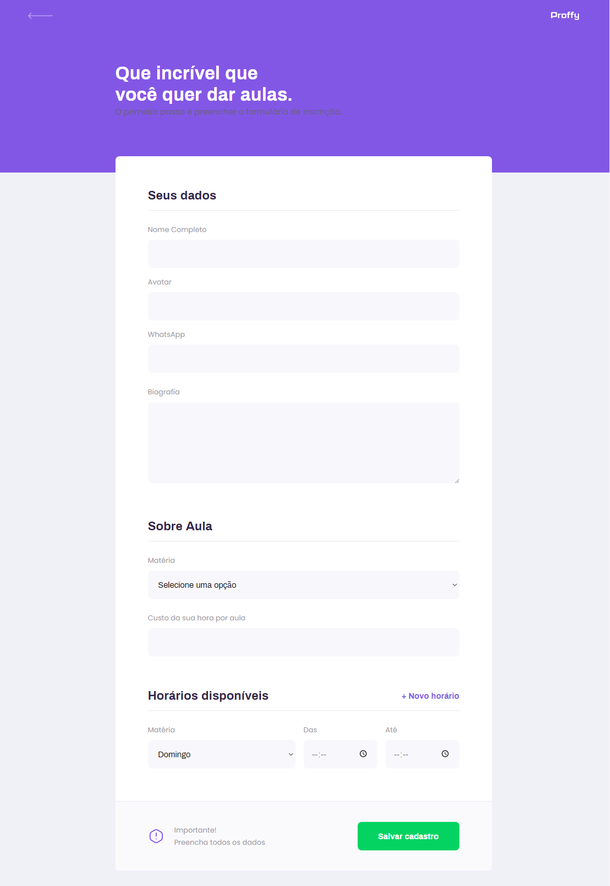

# Plataforma Proffys (NLW2)

#### Projeto versão web para a Next Level Week 2 da RocketSeat
Plataforma com objetivo de conectar professores e alunos.
Encontre o professor da matéria que vocÊ possui dificuldade e tire suas dúvidas através do whatsapp.

Linguagens e Tecnologias
========================
- ReactJS
- Typescript

Bibliotecas
============
- react-router-dom

Screenshots
===================
  
